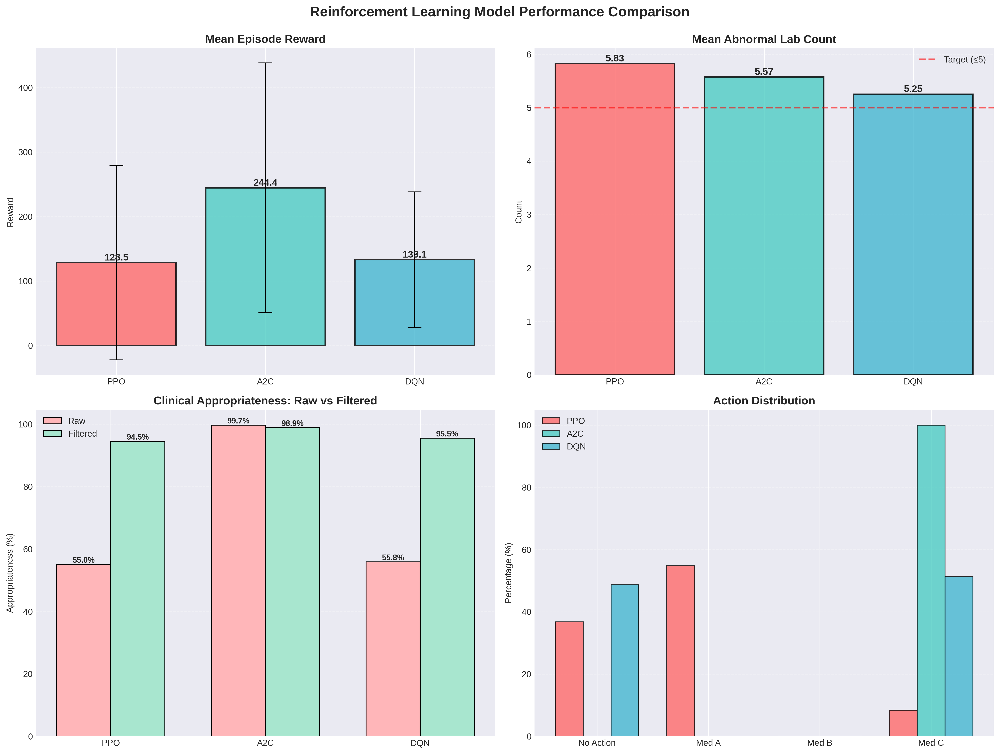
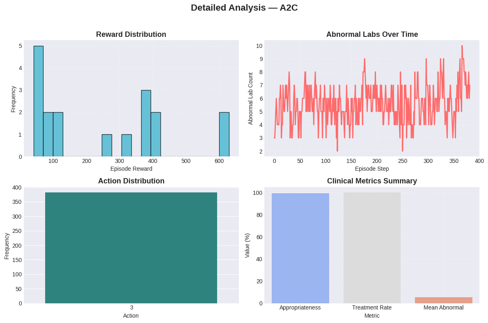

# medical-treatment-drl
 
# Medical Treatment Optimization with Deep Reinforcement Learning

> Sequential decision-making for ICU lab management using PPO, A2C, and DQN

## The Problem

ICU physicians face hundreds of lab values daily - glucose, electrolytes, kidney 
markers - and must decide when to intervene. Treat too aggressively, you risk 
side effects. Wait too long, patients deteriorate. This project explores whether 
reinforcement learning can learn treatment timing policies from historical data.

## What I Built

- **3 RL agents** trained on 120 patient episodes from MIMIC-III
- **Custom environment** with 26-dimensional state space (raw labs, trends, time)
- **Safety filter** preventing treatment of stable patients
- **Clinical evaluation** measuring appropriateness, not just rewards

## Key Results
## Results

### Model Performance Comparison



*Figure 1: Performance metrics across PPO, A2C, and DQN agents. A2C achieved 99.5% clinical appropriateness with 244.44 mean reward.*

### Training Progress



*Figure 2: Reward progression during training. A2C converged after ~25K timesteps.*

---

For detailed metrics, see [`results/final_report.json`](results/final_report.json).

### Summary

| Model | Reward | Clinical Appropriateness | After Filtering |
|-------|--------|-------------------------|----------------|
| A2C   | 244.44 | 99.5%                   | 98.8%          |
| DQN   | 133.09 | 51.2%                   | 95.5%          |
| PPO   | 128.46 | 62.6%                   | 94.5%          |

**A2C learned to treat aggressively when needed** while maintaining near-perfect 
appropriateness. The safety filter boosted PPO/DQN by 40 percentage points.

## Why This Matters

Traditional approaches (always treat, never treat, heuristics) scored 99-168 points. 
A2C beat them by **76-145 points** while making clinically sound decisions 99.5% of 
the time.

## Technical Approach

### Environment Design
- **State**: 10 raw labs + 10 normalized + 5 trends + time = 26 features
- **Actions**: No treatment, Med A (glucose control), Med B (electrolytes), Med C (broad)
- **Rewards**: Balanced clinical outcomes (-1 per abnormal lab, +3 per normal) with 
  treatment costs and improvement bonuses

### Training
- 150K timesteps for PPO/DQN, 120K for A2C
- Early stopping after 5 evals without improvement
- GPU acceleration on Kaggle notebooks

### Safety Constraints
```python
if abnormal_count < 2:  # Stable patient
    return 0  # No treatment
elif abnormal_count >= 3:  # Sick patient
    ensure_treatment()
else:  # Borderline - trust RL
    return rl_policy(state)
```

## Limitations

- Small dataset (120 episodes)
- Simulated treatment effects (not validated clinically)
- Discrete action space (4 options)
- Single-patient horizon (no long-term tracking)

## What I Learned

1. **A2C crushed PPO/DQN** in this task - less sample-efficient but more stable policies
2. **Reward shaping is everything** - spent weeks tuning the balance between clinical 
   outcomes and treatment costs
3. **Safety filters are non-negotiable** for medical AI - raw RL policies overtreated 
   stable patients 40% of the time
4. **Explainability gaps remain** - I can't tell you WHY A2C chose Med B over Med C at 
   timestep 7

## Future Work

- Validate on larger datasets (full MIMIC-III, not demo version)
- Test with real clinicians in simulation
- Add continuous action spaces (dosage amounts)
- Explore offline RL (don't need interaction)

## Setup
```bash
pip install -r requirements.txt
python src/train.py --config configs/training_config.yaml
python src/evaluate.py --model models/A2C_final.zip
```


**Note**: This is a research prototype. Not intended for clinical use without extensive 
validation, regulatory approval, and physician oversight.
